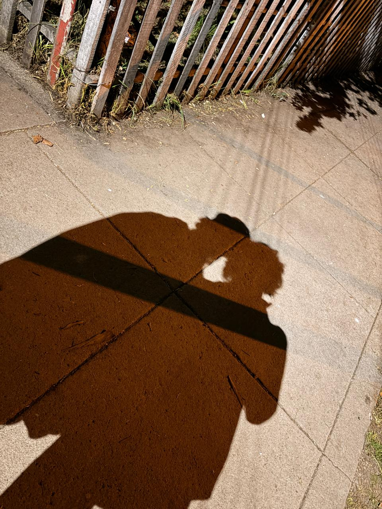

# 🌻 Flores Amarillas para Ti 💛 (Edición Especial Plantas vs Zombies)

Un proyecto web interactivo, romántico y animado diseñado para sorprender a tu novia en el **Día de las Flores Amarillas** (20-21 de Septiembre).

Incluye:
- **Girasol de Plants vs. Zombies** animado en SVG con su clásico y tierno baile rítmico.
- Canción oficial **"Zombies on Your Lawn"** de **Laura Shigihara** integrada.
- **Soles dorados interactivos** que caen y se pueden recolectar (hacen sonido alegre de `+50 Amor 💛`).
- **Lluvia suave de pétalos amarillos** con física de viento en HTML5 Canvas.
- **Tarjeta romántica personalizable** con efecto de cristal (*glassmorphism*) y frases de amor.
- **Espacio para foto de ustedes** estilo Polaroid.
- Modal interactivo con **"Razones por las que te amo"**.
- 100% responsivo (se ve increíble en celulares al abrirlo desde WhatsApp).

---

## 🚀 Cómo Probarlo en Tu Computadora

1. Abre la carpeta del proyecto:
   `c:\Users\ricardo.izaguirre\Documents\flores amarillas test`
2. Haz doble clic sobre el archivo **`index.html`**. Se abrirá directamente en tu navegador (Chrome, Edge, Firefox, Safari).
3. ¡Haz clic en **"¡Toca para abrir tu sorpresa!"** y disfruta la magia!

---

## 🌐 Cómo Publicarlo GRATIS para Enviárselo por WhatsApp

Tienes varias opciones súper sencillas para tener un enlace público gratuito (por ejemplo `https://tu-usuario.github.io/flores-amarillas`):

### Opción 1: GitHub Pages (Recomendado y 100% Gratis)

1. Entra a [github.com](https://github.com) e inicia sesión (o crea una cuenta gratuita si no tienes).
2. Haz clic en el botón verde **"New"** (Nuevo Repositorio).
3. Ponle de nombre al repositorio algo bonito, por ejemplo: `flores-amarillas` o `para-ti`.
4. Asegúrate de marcarlo como **Public** (Público).
5. Sube los archivos de esta carpeta:
   - `index.html`
   - `style.css`
   - `script.js`
   - La carpeta `audio/` con la canción `zombies-on-your-lawn.mp3`
   *(Si usas la web de GitHub, puedes arrastrar y soltar todos los archivos directamente con la opción "uploading an existing file")*.
6. Una vez subidos los archivos:
   - Ve a la pestaña **Settings** (Configuración) de tu repositorio.
   - En el menú lateral izquierdo, haz clic en **Pages**.
   - En **Branch**, selecciona `main` (o `master`) y la carpeta `/ (root)`, luego pulsa **Save**.
7. ¡Listo! En 1 minuto GitHub te dará un enlace como:
   `https://tu-usuario.github.io/flores-amarillas/`
   Ese enlace se lo puedes enviar por WhatsApp y ella podrá abrirlo desde su teléfono.

---

### Opción 2: Netlify Drop (La más rápida - En 1 minuto sin configurar nada)

1. Entra a [app.netlify.com/drop](https://app.netlify.com/drop).
2. Arrastra la carpeta completa `flores amarillas test` hacia el recuadro que dice *"Drag and drop your site folder here"*.
3. En 5 segundos se publicará tu página y te dará un enlace instantáneo para compartir.

---

## ✏️ Cómo Personalizar el Mensaje y la Foto

### 1. Cambiar los textos o dedicatoria:
Abre el archivo [index.html](file:///c:/Users/ricardo.izaguirre/Documents/flores%20amarillas%20test/index.html) con el Bloc de notas o tu editor de código favorito y busca la sección:
```html
<h2 class="card-main-title">Para la persona que ilumina mis días 💛</h2>
```
Ahí puedes poner su nombre o cambiar el mensaje por tus propias palabras.

### 2. Agregar una foto juntos:
Si quieres que aparezca su foto en el recuadro polaroid:
1. Guarda tu foto en esta misma carpeta con el nombre `foto.jpg`.
2. En [index.html](file:///c:/Users/ricardo.izaguirre/Documents/flores%20amarillas%20test/index.html), busca el bloque `<div class="photo-placeholder" id="photo-container">` y reemplázalo por:
   ```html
   
   ```

---

## 🎵 Créditos
- Canción: *"Zombies on Your Lawn"* compuesta e interpretada por **Laura Shigihara** (Plants vs. Zombies OST).
- Personaje: Girasol (*Sunflower*) de Plants vs. Zombies (PopCap Games / EA).
